# Kafka Lite v1.0

Kafka Lite is a high-throughput, persistent, multi-threaded message broker inspired by Apache Kafka. It implements core distributed messaging concepts including topic partitioning, persistent append-only logs, consumer groups, automatic rebalancing, and consumer lag tracking—without the overhead of heavy distributed systems like Zookeeper.

## 🌟 Key Features

- **Topics & Partitions**: Messages are routed using Key-based hashing or Round-Robin algorithms to support massive concurrency across multiple partitions.
- **Consumer Groups**: Distributed processing with automatic, dynamic partition assignment to group members.
- **Fault Tolerance**: Background heartbeat mechanisms detect consumer crashes and trigger automatic partition rebalancing.
- **Persistent Storage**: O(1) append-only disk storage leveraging memory-mapped-like index lookups for blazing fast retrieval.
- **Retention Policies**: Configurable background thread for time-based and size-based automatic log cleanup.
- **Observability**: Real-time APIs to track TPS (Throughput), consumer lag, and broker health.
- **High Performance**: Lock-free atomic counters, Readers-Writer locks, and `publish_batch` support for 500k+ messages per second.
- **Web Dashboard**: Included zero-dependency Python dashboard for real-time monitoring of metrics.

---

## 🛠️ Building and Running

### Prerequisites
- C++17 Compiler (Visual Studio MSVC recommended for Windows)
- CMake 3.14+
- Python 3 (For running benchmarks, tests, and the dashboard)

### Build the Broker
```bash
mkdir build
cd build
cmake ..
cmake --build .
```

### Start the Broker
The broker will automatically read the `config.json` file in the root directory.
```bash
./build/Debug/kafka_lite.exe
```

### Start the Dashboard
In a separate terminal, start the Python dashboard server:
```bash
python dashboard/server.py
```
Open `http://localhost:8080` in your web browser.

---

## 📐 Architecture Diagrams

The following diagrams accurately represent the specific C++ implementation of this broker.

### 1. Overall Component Architecture
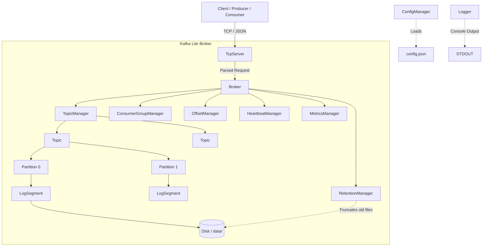

### 2. Class Relationship Diagram
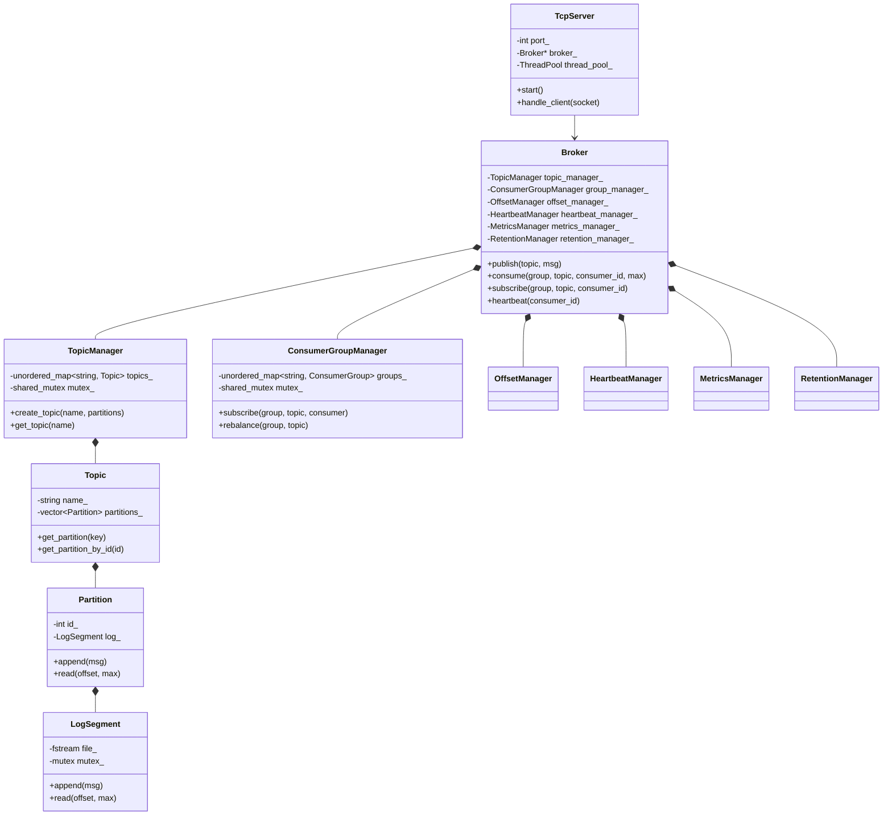

### 3. Publish Flow Sequence Diagram
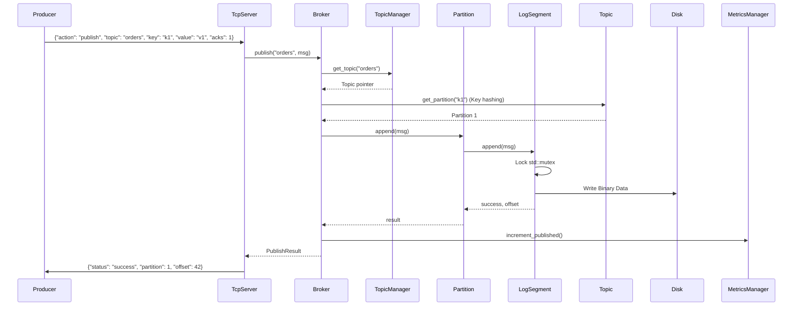

### 4. Consume Flow Sequence Diagram
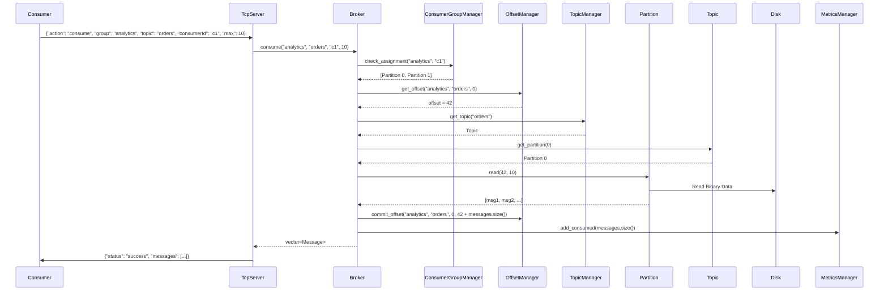

### 5. Consumer Group Rebalancing Sequence Diagram
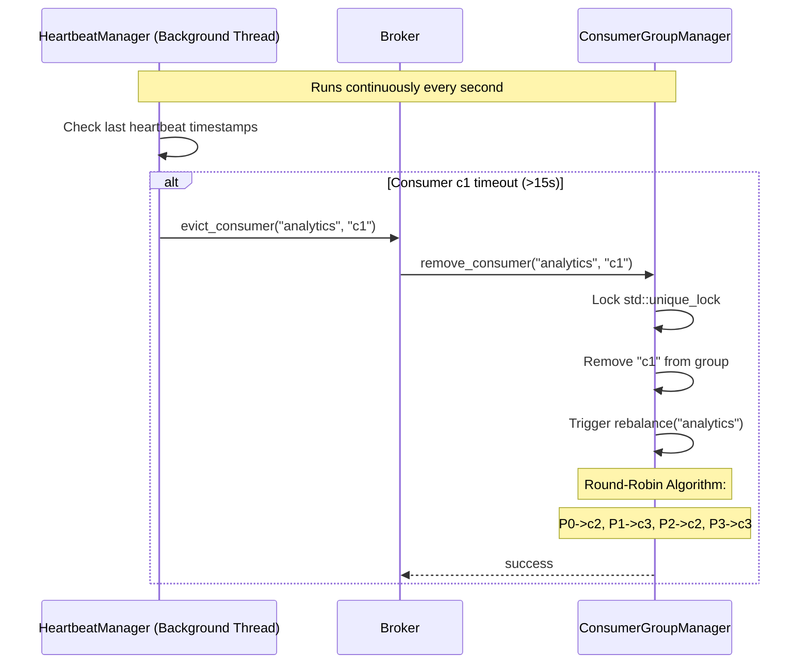

### 6. Startup & Recovery Flow
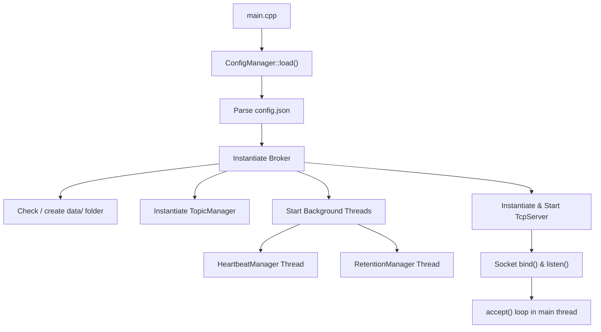

### 7. Thread Architecture
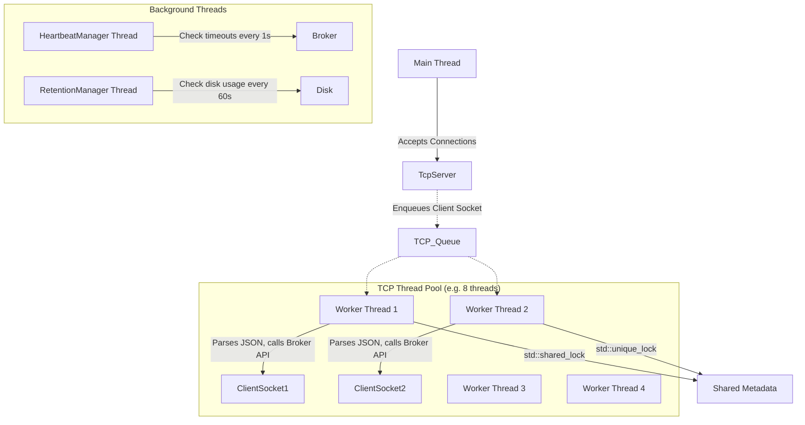

### 8. Storage Architecture
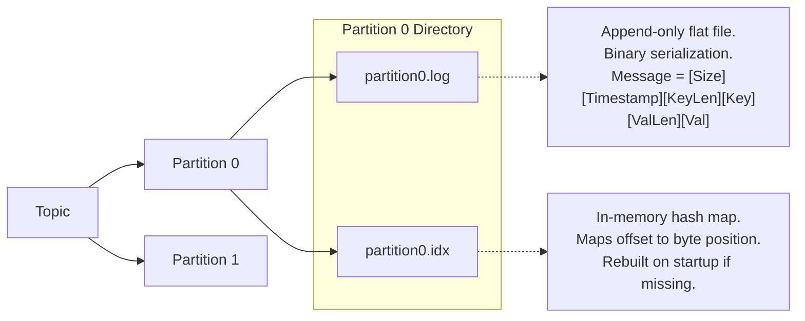

### 9. Network Architecture
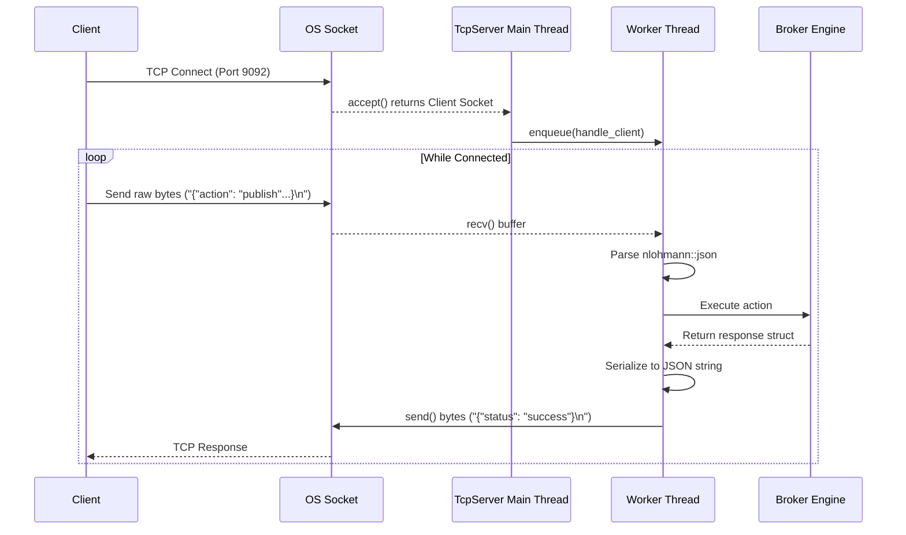

---

## 📈 Benchmarks (Real World Data)

These benchmarks were generated on a standard development machine using the automated `benchmark/run_all_benchmarks.py` script.

| Test | Result |
|------|--------|
| **Single Producer Throughput** | 527,804 msg/sec |
| **10 Producers Throughput** (Disk Bound) | 326,298 msg/sec |
| **Batch Size 1000 Latency** (acks=1) | 26.45 ms |
| **Recovery Time** (1 Million Msgs) | 0.51 sec |

### Performance Graphs

**Throughput vs Producers**

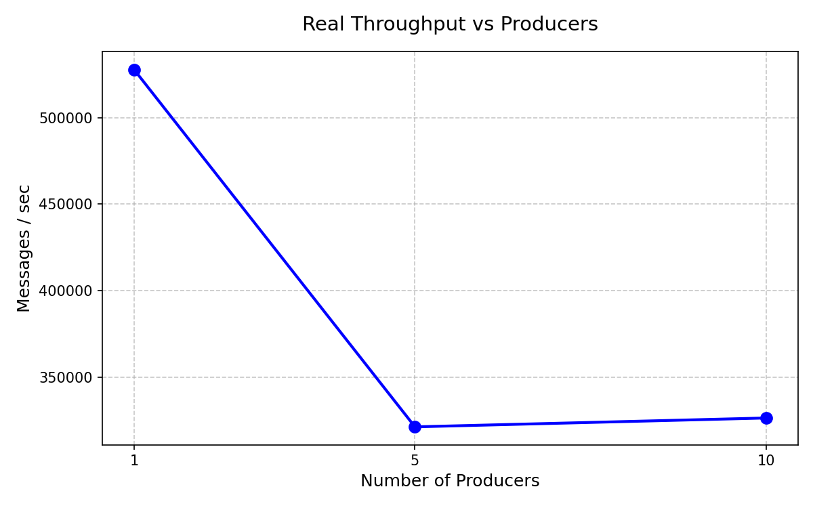

**Latency vs Batch Size**

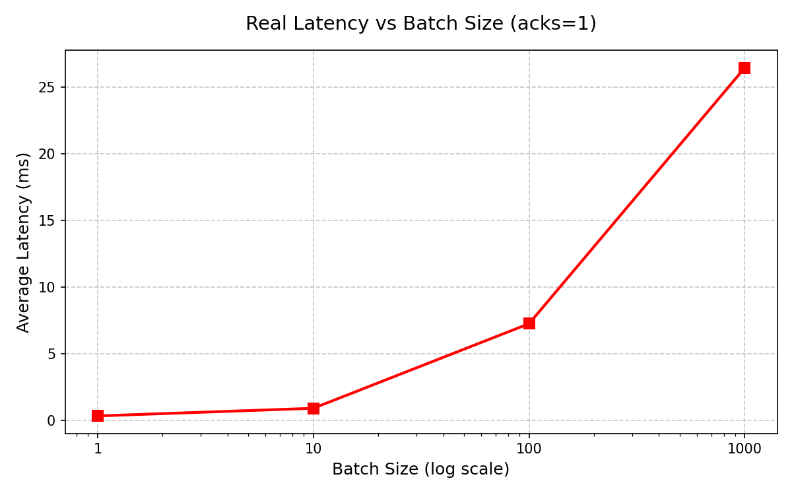

**Recovery Time vs Messages**

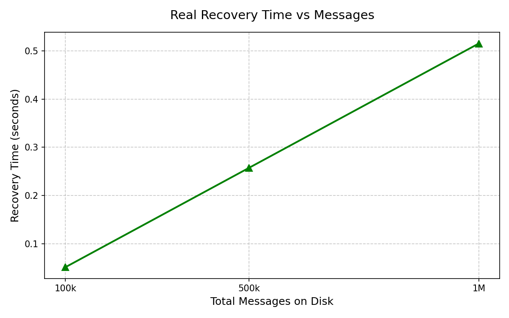
